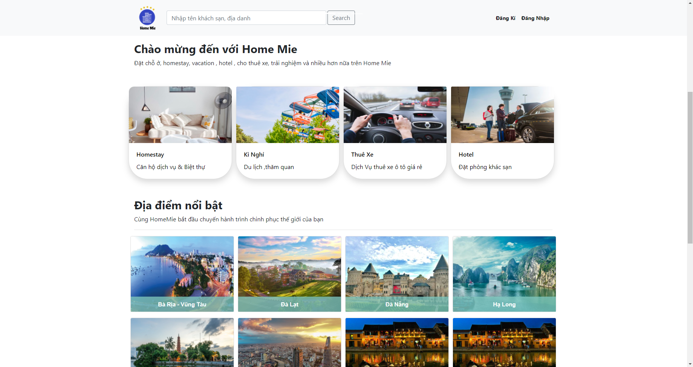

# Project Home Mie 

<h2>Information</h2>
Tech : Servlet , JSP , SQL  
User Account, Admin page,  
Like List , Cart Rent , Book Room  
Paging ,Sort  , Search (VN- EN)  

<h2>Demo</h2>
<a href="https://www.youtube.com/watch?v=rv7FjCBrnE0&feature=youtu.be">Homemie</a>

<h2>Installation</h2>
Run SQL file (homemie.sql)  
Start web with indexControler.java (servlet) in Controller package
<h2>Examples</h2>
  
  
  
  
  

<h2>License</h2>

This project is licensed under the terms of Homemie

